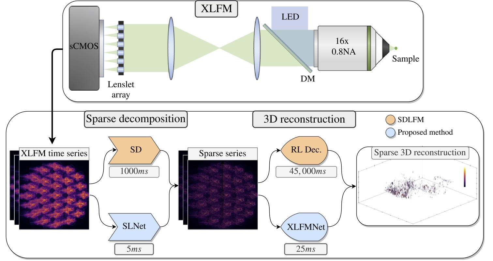
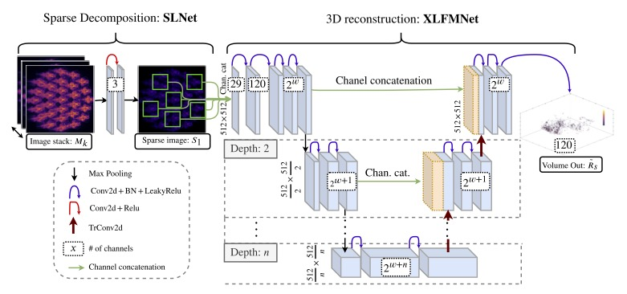

<!--- [![Forks][forks-shield]][forks-url]
[![Stargazers][stars-shield]][stars-url] 
[![Issues][issues-shield]][issues-url]-->
[![Apache License][license-shield]][license-url]
[![Google Scholar][gs-shield]][gs-url]

# Real-Time Light Field 3D Microscopy via Sparsity-Driven Learned Deconvolution

* [About the Project](#about)
* [Requirements](#requirements)
* [Network structure](#network-structure)
* [Usage](#usage)
  * [Train](#train)
  * [Test](#train)
* [Acknowledgements](#acknowledgements)
* [Sources](#sources)
* [Citing this work](#citing-this-work)
* [Contact](#contact)

## About
This repository contains the code from our SLNet+XLFMNet. SLNeet computes from a temporal stack of 3 fluorescence microscopy images, a temporal and spatial sparse representation, allowing the extraction of neural activity in live animals, and getting rid of the background. This with a network trained in an unsupervised fashion and with an infercence framerate of 40Hz. XLFMNet is a CNN that reconstructs a 3D volume from a single XLFM image (or Fourier Light field microscopy).
In our case the sparse decomposition + 3D reconstruction runs at 45Hz for an image with 2160x2160 pixels and reconstructiong a volume with 512x512*120 voxels.




## Requirements
The repo is based on Python 3.7.4 and Pytorch 1.8, see requirements.txt for more details.
For the sparse decomposition network (SLNet) you can use any microscopy images desired and it will find the sparseness in your sample.  
To perform 3D reconstrution you will need:
* A 3D space variant PSF in matlab format in matlab format (.mat) with dimmensions [x,y,z]. This PSF is used to compute the GT for training with Richardson Lucy deconvolution. 
* A list of coordinates of the center of the lenslets on your Fourier Light Field Microscopy system, store them in "lenslet_coords.txt".
* The input images need to be in a directory structure as:  /XLFM_image/XLFM_image_stack.tif.
  
## Network structure
The SLNet grabs 3 images from different time frames (captured with 50ms in between for example) and runs them through a very simple CNN, this computes a low rank representation, this works with any size of images.

  XLFMNet is a U-net that takes as an input the cropped micro-lenses images from the raw XLFM microscope, and produces a 3D volume with the same spatial dimensions as the input, but with depths encoded in the channel dimension, in our case 120 depths.
  



## Usage
  #### SLNet Input
  A tensor with shape **batch,nT,x,y**. Where nT is the number of temporal frames to use, in our case **nT=3**.
  #### Output
  A tensor with shape **batch,nT,x,y**, containing the low rank representation of the input, the sparse representation can be then computed bye **sparse = relu(input - low_rank)**.
  #### XLFMNet Input
  A tensor with shape **batch,nL,x,y**. Where nL are the number of micro-lenses in the system.
  #### Output
  A 3D volume with the shape **batch,nD,x,y**. Where nD are the number of desired depths.
    
### Train workflow
* mainTrainSLNet.py: Train the SLNet unsupervised (no GT, only minimizing a loss function with the raw images).
* mainCreateDataset.py: Generate a image -> 3D volume dataset to train the XLFMNet
* mainTrainXLFMNet.py: Train the XLFMNet with the freshly created dataset.


#### Train SLNet
```bash
python3 mainTrain.py
```

|Parameter|Default|Description|
|---|---|---|
|data_folder|""|Input training images path.|
|data_folder_test| ""|Input testing image path|
|lenslet_file| "lenslet_coords.txt"|Text file with the lenslet coordinates pairs x y "\n"|
|files_to_store|[]|Relative paths of files to store in a zip when running this script, for backup.|
|prefix| ""|Prefix string for the output folder.|
|checkpoint| ""|File path of checkpoint of previous run.|
|**Images related arguments**||
|images_to_use|list(range(0,140,1))|Indeces of images to train on.|
|images_to_use_test|list(range(0,36,1))|Indeces of images to test on.|
|lenslet_crop_size|512|Side size of the microlens image.|
|img_size|2160|Side size of input image, square prefered.|
|**Training arguments**||
|batch_size|8|Training batch size.| 
|learning_rate|0.0001|Training learning rate.|
|max_epochs|201|Training epochs to run.|
|validation_split|0.1|Which part to use for validation 0 to 1.|
|eval_every|10|How often to evaluate the testing/validaton set.|
|shuffle_dataset|1|Radomize training images 0 or 1|
|use_bias|0|Use bias during training? 0 or 1|
|**Noise arguments**||
|add_noise|0|Apply noise to images? 0 or 1|
|signal_power_max|30^2|Max signal value to control signal to noise ratio when applyting noise.|
|signal_power_min|60^2|Min signal value to control signal to noise ratio when applyting noise.|
|norm_type|2|Normalization type, see the normalize_type function for more info.|
|dark_current|106|Dark current value of camera.|
|dark_current_sparse|0|Dark current value of camera.|
|**Sparse decomposition arguments**||
|n_frames|3|Number of frames used as input to the SLNet.|
|rank|3|Rank enforcement for SVD. 6 is good|
|SL_alpha_l1|0.1|Threshold value for alpha in sparse decomposition.|
|SL_mu_sum_constraint|1e-2|Threshold value for mu in sparse decomposition.|
|weight_multiplier|0.5|Initialization multiplyier for weights, important parameter.|
|**SLNet config**||
|temporal_shifts|[0,49,99]|Which frames to use for training and testing.|
|use_random_shifts|0|Randomize the temporal shifts to use? 0 or 1|
|frame_to_grab|0|Which frame to show from the sparse decomposition?|
|l0_ths|0.05|Threshold value for alpha in nuclear decomposition|
|**misc arguments**||
|output_path|runs_dir + '/camera_ready/')
|main_gpu|[5]|List of GPUs to use: [0,1]|

#### Generate training dataset for XLFMNet
```bash
python3 mainCreateDataset.py
```
XLFMNet is trained with sparse images and 3D volumes.
This script generates the sparse representation with a pretrained SLNet and performs a 3D deconvolution to this data. Additionally it computes the standard SD decomposition from [1], and it's deconvolution, for comparison. To enable the SD set the --SD_iterations > 0.


|Parameter|Default|Description|
|---|---|---|
|SD_iterations|10|Number of iterations for Sparse Decomposition, 0 to disable.|
|frame_to_grab|0|Which frame to show from the sparse decomposition?|
|deconv_iterations|30|Number of iterations for 3D deconvolution, for GT volume generation.|
|deconv_n_depths|120|Number of depths to create in 3D deconvolution.|
|deconv_limit|10000|Maximum intensity allowed from doconvolution.|
|deconv_gpu|-1|GPU to use for deconvolution, -1 to use CPU, this is very memory intensive.|

#### Generate training dataset for XLFMNet
```bash
python3 mainCreateDataset.py
```
XLFMNet is trained with sparse images and 3D volumes.
This script generates the sparse representation with a pretrained SLNet and performs a 3D deconvolution to this data. Additionally it computes the standard SD decomposition from [1], and it's deconvolution, for comparison. To enable the SD set the --SD_iterations > 0.


|Parameter|Default|Description|
|---|---|---|
|SD_iterations|10|Number of iterations for Sparse Decomposition, 0 to disable.|
|frame_to_grab|0|Which frame to show from the sparse decomposition?|
|deconv_iterations|30|Number of iterations for 3D deconvolution, for GT volume generation.|
|deconv_n_depths|120|Number of depths to create in 3D deconvolution.|
|deconv_limit|10000|Maximum intensity allowed from doconvolution.|
|deconv_gpu|-1|GPU to use for deconvolution, -1 to use CPU, this is very memory intensive.|


## Acknowledgements
* [Computational Imaging and Inverse Problems, University of Munich](https://ciip.in.tum.de/ "")
* [Synthetic Neurobiology Group, MIT](http://syntheticneurobiology.org/ "")
* [Computer Vision Group, University of Bern](http://www.cvg.unibe.ch/ "")
* [McGovern Institute for Brain Research, MIT](https://mcgovern.mit.edu/ "")

## Sources

1. [Yoon, Young-Gyu and Wang, Zeguan and Pak, Nikita and Park, Demian and Dai, Peilun and Kang, Jeong Seuk and Suk, Ho-Jun and Symvoulidis, Panagiotis and Guner-Ataman, Burcu and Wang, Kai and Boyden, Edward S. "Sparse decomposition light-field microscopy for high speed imaging of neuronal activity" *Optica 2020*](https://www.osapublishing.org/optica/fulltext.cfm?uri=optica-7-10-1457&id=441774)

## Contact
Josue Page - josue.page@tum.de
Project Link: [https://github.com/pvjosue/SLNet_XLFMNet](https://github.com/pvjosue/SLNet_XLFMNet)


## Citing this work
```bibtex
@article{pageXLFMNet2021,
    author = {Page~Vizcaino, Josue and Wang, Zeguan and Symvoulidis, Panagiotis and Favaro, Paolo and Guner-Ataman, Burcu and Boyden, Edward~S. and Lasser, Tobias},
    title = {Real-Time Light Field 3D Microscopy via Sparsity-Driven Learned Deconvolution},
    booktitle = {to be available},
    year = {2021}
}
```


[forks-shield]: https://img.shields.io/github/forks/othneildrew/Best-README-Template.svg?style=flat-square
[forks-url]: https://github.com/pvjosue/LFMNet/network/members
[stars-shield]: https://img.shields.io/github/stars/othneildrew/Best-README-Template.svg?style=flat-square
[stars-url]: https://github.com/pvjosue/LFMNet/stargazers
[issues-shield]: https://img.shields.io/github/issues/othneildrew/Best-README-Template.svg?style=flat-square
[issues-url]: https://github.com/pvjosue/LFMNet/issues
[license-shield]: https://img.shields.io/github/license/othneildrew/Best-README-Template.svg?style=flat-square
[license-url]: https://github.com/pvjosue/LFMNet/blob/master/LICENSE
[gs-shield]: https://img.shields.io/badge/-GoogleScholar-black.svg?style=flat-square&logo=google-scholar&colorB=555
[gs-url]: https://scholar.google.com/citations?user=5WfCRjQAAAAJ&hl=en
[product-screenshot]: images/screenshot.png


